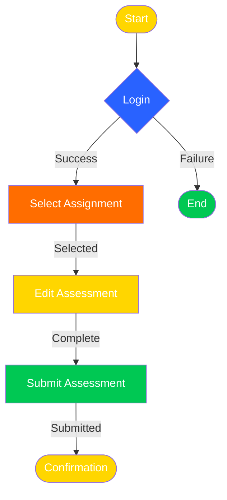

### Learner of Teacher editing UML activity diagram

```mermaid
flowchart TD
    Start(["Start"]) --> Login{"Login"}
    Login -- Success --> SelectAssignment["Select Assignment"]
    SelectAssignment -- Selected --> EditAssessment["Edit Assessment"]
    EditAssessment -- Complete --> Submit["Submit Assessment"]
    Submit -- Submitted --> Confirmation(["Confirmation"])
    Login -- Failure --> End(["End"])

    style Start fill:#FFD600,color:#FFFFFF
    style Login fill:#2962FF,color:#FFFFFF
    style SelectAssignment fill:#FF6D00,color:#FFFFFF
    style EditAssessment fill:#FFD600,color:#FFFFFF
    style Submit fill:#00C853,color:#FFFFFF
    style Confirmation fill:#FFD600,color:#FFFFFF
    style End fill:#00C853,color:#FFFFFF
```