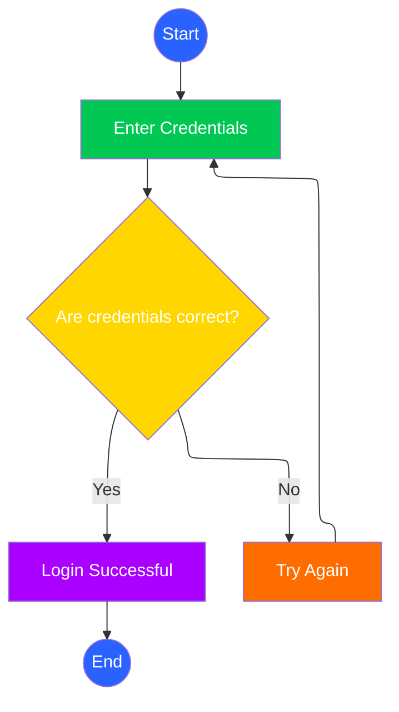

### Learner Login UML Activity Diagram

```mermaid
---
config:
  layout: elk
---
flowchart TD
    Start(("Start")) --> LoginScreen["Enter Credentials"]
    LoginScreen --> CheckCredentials{"Are credentials correct?"}
    CheckCredentials -- Yes --> SuccessfulLogin["Login Successful"]
    CheckCredentials -- No --> Retry["Try Again"]
    Retry --> LoginScreen
    SuccessfulLogin --> End(("End"))
    style Start fill:#2962FF,color:#FFFFFF
    style LoginScreen fill:#00C853,color:#FFFFFF
    style CheckCredentials fill:#FFD600,color:#FFFFFF
    style SuccessfulLogin fill:#AA00FF,color:#FFFFFF
    style Retry fill:#FF6D00,color:#FFFFFF
    style End fill:#2962FF,color:#FFFFFF

```