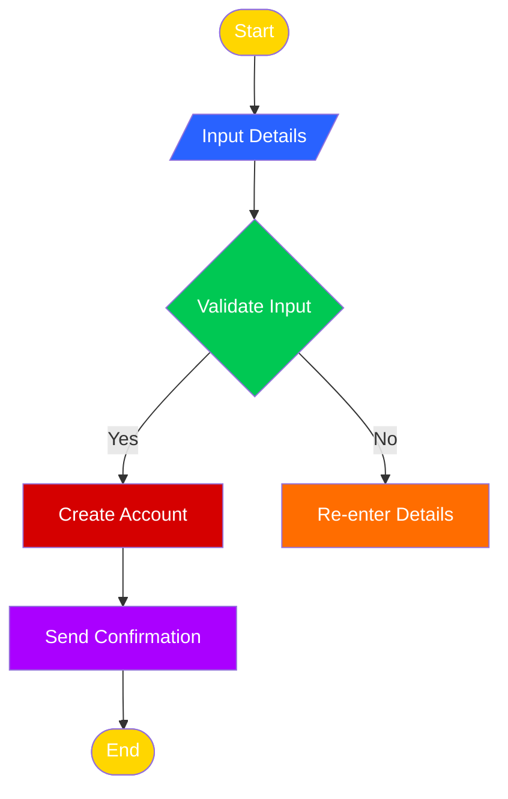

### Learner Registration UML Activity Diagram

```mermaid
flowchart TD
    Start(["Start"]) --> InputDetails[/"Input Details"/]
    InputDetails --> ValidateInput{"Validate Input"}
    ValidateInput -- Yes --> CreateAccount["Create Account"]
    ValidateInput -- No --> ReenterDetails["Re-enter Details"]
    CreateAccount --> SendConfirmation["Send Confirmation"]
    SendConfirmation --> End(["End"])

    style Start fill:#FFD600,color:#FFFFFF
    style InputDetails color:#FFFFFF,fill:#2962FF
    style ValidateInput fill:#00C853,color:#FFFFFF
    style CreateAccount fill:#D50000,color:#FFFFFF
    style ReenterDetails fill:#FF6D00,color:#FFFFFF
    style SendConfirmation fill:#AA00FF,color:#FFFFFF
    style End fill:#FFD600,color:#FFFFFF

```