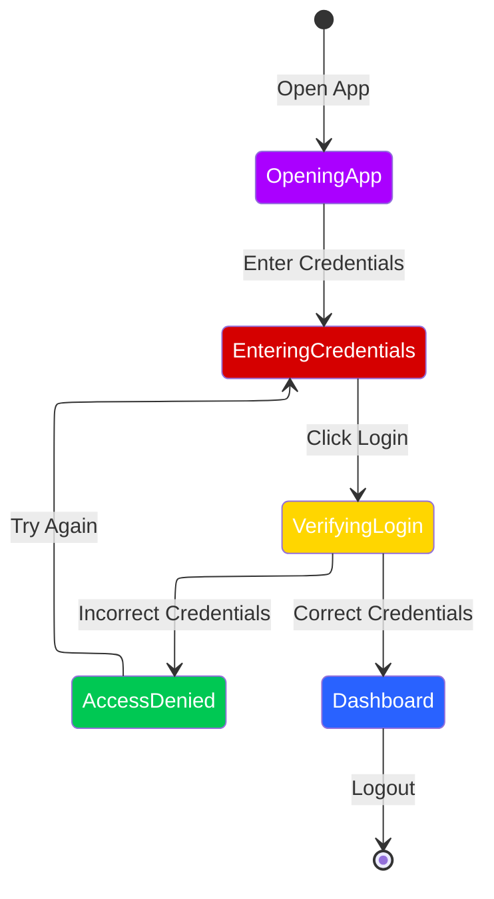

### Learner Login State Diagram in md format

```mermaid

---
config:
  layout: elk
---
stateDiagram
  direction TB
  [*] --> OpeningApp:Open App
  OpeningApp --> EnteringCredentials:Enter Credentials
  EnteringCredentials --> VerifyingLogin:Click Login
  VerifyingLogin --> AccessDenied:Incorrect Credentials
  VerifyingLogin --> Dashboard:Correct Credentials
  AccessDenied --> EnteringCredentials:Try Again
  Dashboard --> [*]:Logout
  style OpeningApp fill:#AA00FF,color:#FFFFFF
  style EnteringCredentials fill:#D50000,color:#FFFFFF
  style VerifyingLogin fill:#FFD600,color:#FFFFFF
  style AccessDenied fill:#00C853,color:#FFFFFF
  style Dashboard fill:#2962FF,color:#FFFFFF

```

### The state diagram maps (EnteringCredentials and VerifyingLogin states) maps the user number two Login functional requirements