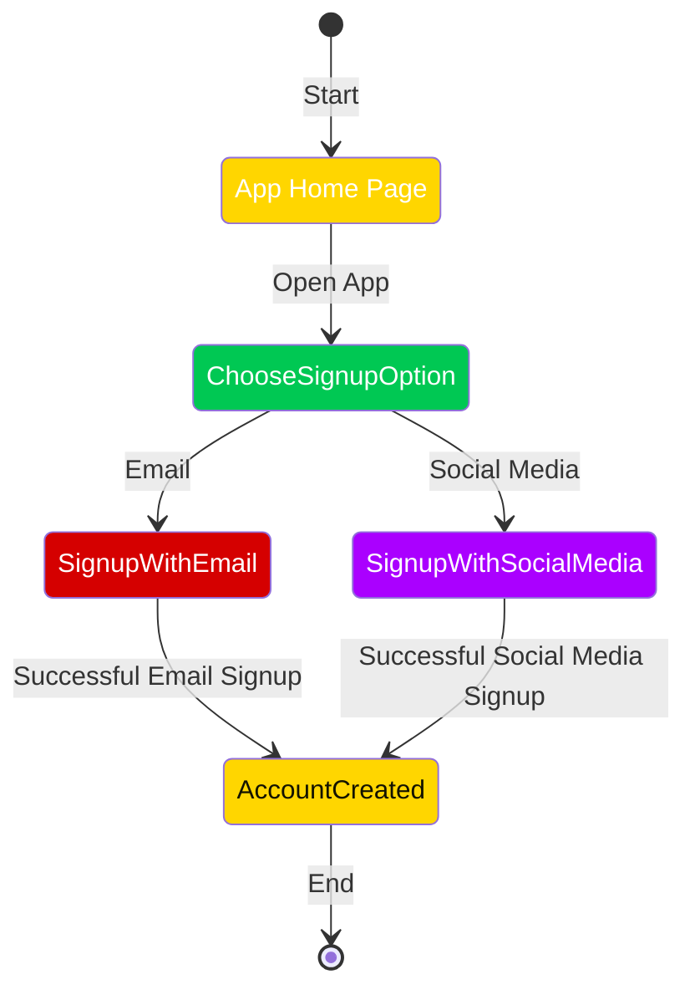

### Registration State Diagram

```mermaid

stateDiagram
  direction TB
  [*] --> OpenApp:Start
  OpenApp --> ChooseSignupOption:Open App
  ChooseSignupOption --> SignupWithEmail:Email
  ChooseSignupOption --> SignupWithSocialMedia:Social Media
  SignupWithEmail --> AccountCreated:Successful Email Signup
  SignupWithSocialMedia --> AccountCreated:Successful Social Media Signup
  AccountCreated --> [*]:End
  OpenApp:App Home Page
  style OpenApp fill:#FFD600,color:#FFFFFF
  style ChooseSignupOption fill:#00C853,color:#FFFFFF
  style SignupWithEmail fill:#D50000,color:#FFFFFF
  style SignupWithSocialMedia fill:#AA00FF,color:#FFFFFF
  style AccountCreated fill:#FFD600

```
### The state diagram maps (ChooseSignupOption state) with the number one Functional requirements on Assignment 4.