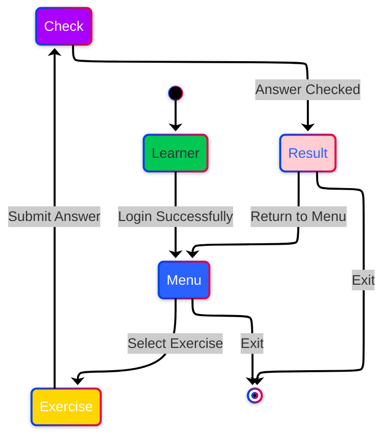

### Learner Taking an assessment or Test! 

```mermaid

---
config:
  layout: elk
  look: neo
  theme: neo
---
stateDiagram
  direction TB
  [*] --> Learner
  Learner --> Menu:Login Successfully
  Menu --> Exercise:Select Exercise
  Exercise --> Check:Submit Answer
  Check --> Result:Answer Checked
  Result --> Menu:Return to Menu
  Result --> [*]:Exit
  Menu --> [*]:Exit
  style Learner fill:#00C853
  style Menu fill:#2962FF,color:#FFFFFF
  style Exercise fill:#FFD600,color:#FFFFFF
  style Check fill:#AA00FF,color:#FFFFFF
  style Result fill:#FFCDD2,color:#2962FF


```
### This state diagram maps the begin assessment functional requirement number 5