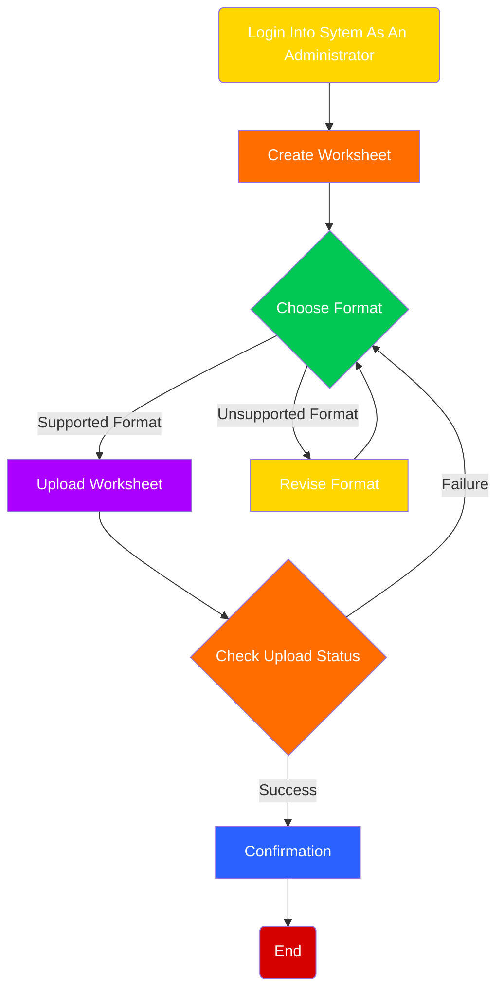

```mermaid
---
config:
  layout: dagre
---
flowchart TD
    A("Login Into Sytem As An Administrator") --> B["Create Worksheet"]
    B --> C{"Choose Format"}
    C -- Supported Format --> D["Upload Worksheet"]
    C -- Unsupported Format --> E["Revise Format"]
    E --> C
    D --> F{"Check Upload Status"}
    F -- Success --> G["Confirmation"]
    F -- Failure --> C
    G --> H("End")
    style A fill:#FFD600,color:#FFFFFF
    style B fill:#FF6D00,color:#FFFFFF
    style C fill:#00C853,color:#FFFFFF
    style D fill:#AA00FF,color:#FFFFFF
    style E fill:#FFD600,color:#FFFFFF
    style F fill:#FF6D00,color:#FFFFFF
    style G fill:#2962FF,color:#FFFFFF
    style H fill:#D50000,color:#FFFFFF

```

### The state diagram maps the upload functional requirements number 7 in assignment 4,