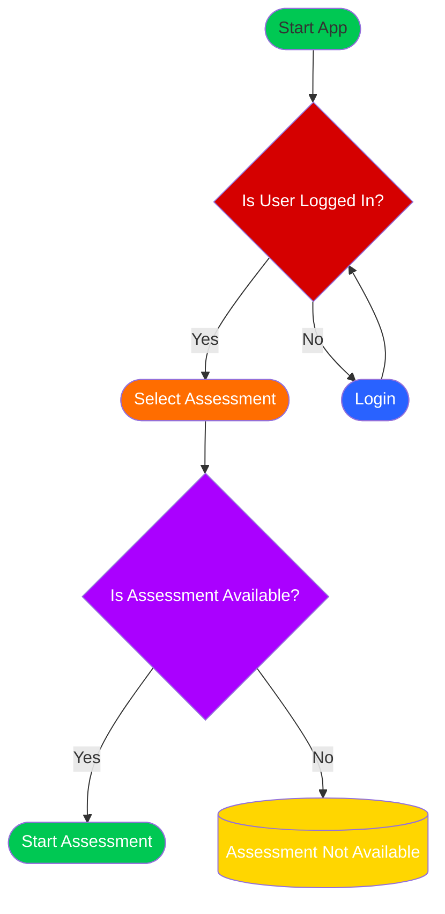

### A UML activity diagram for beginning an assessment

```mermaid
flowchart TD
    StartApp(["Start App"]) --> UserLoggedIn{"Is User Logged In?"}
    UserLoggedIn -- Yes --> SelectAssessment(["Select Assessment"])
    UserLoggedIn -- No --> Login(["Login"])
    Login --> UserLoggedIn
    SelectAssessment --> AssessmentAvailable{"Is Assessment Available?"}
    AssessmentAvailable -- Yes --> StartAssessment(["Start Assessment"])
    AssessmentAvailable -- No --> NoteAvailable[("Assessment Not Available")]

    style StartApp fill:#00C853
    style UserLoggedIn fill:#D50000,color:#FFFFFF
    style SelectAssessment fill:#FF6D00,color:#FFFFFF
    style Login fill:#2962FF,color:#FFFFFF
    style AssessmentAvailable fill:#AA00FF,color:#FFFFFF
    style StartAssessment fill:#00C853,color:#FFFFFF
    style NoteAvailable fill:#FFD600,color:#FFFFFF


```