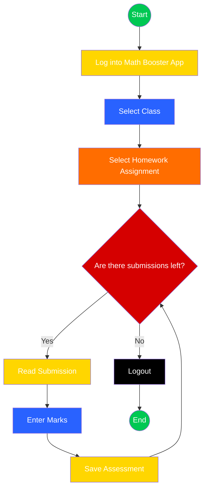

### Marks grading UML activity daigram

```mermaid
flowchart TD
    A(("Start")) --> B["Log into Math Booster App"]
    B --> C["Select Class"]
    C --> D["Select Homework Assignment"]
    D --> E{"Are there submissions left?"}
    E -- Yes --> F["Read Submission"]
    F --> G["Enter Marks"]
    G --> H["Save Assessment"]
    H --> E
    E -- No --> I["Logout"]
    I --> J(("End"))

    style A fill:#00C853,color:#FFFFFF
    style B fill:#FFD600,color:#FFFFFF
    style C fill:#2962FF,color:#FFFFFF
    style D fill:#FF6D00,color:#FFFFFF
    style E fill:#D50000,color:#FFFFFF
    style F fill:#FFD600,color:#FFFFFF
    style G fill:#2962FF,color:#FFFFFF
    style H fill:#FFD600,color:#FFFFFF
    style I color:#FFFFFF,fill:#000000
    style J fill:#00C853,color:#FFFFFF
```