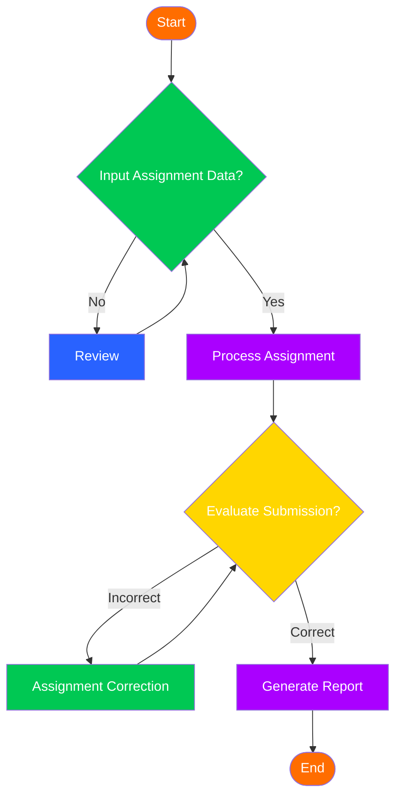

```mermaid
flowchart TD
    Start(["Start"]) --> InputData{"Input Assignment Data?"}
    InputData -- No --> Review["Review"]
    Review --> InputData
    InputData -- Yes --> Process["Process Assignment"]
    Process --> Evaluate{"Evaluate Submission?"}
    Evaluate -- Incorrect --> Correction["Assignment Correction"]
    Correction --> Evaluate
    Evaluate -- Correct --> GenerateReport["Generate Report"]
    GenerateReport --> Finish(["End"])

    style Start fill:#FF6D00,color:#FFFFFF
    style InputData fill:#00C853,color:#FFFFFF
    style Review fill:#2962FF,color:#FFFFFF
    style Process fill:#AA00FF,color:#FFFFFF
    style Evaluate fill:#FFD600,color:#FFFFFF
    style Correction fill:#00C853,color:#FFFFFF
    style GenerateReport fill:#AA00FF,color:#FFFFFF
    style Finish fill:#FF6D00,color:#FFFFFF
```