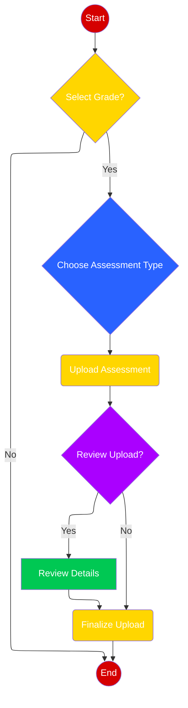

```mermaid
---
config:
  layout: elk
---
flowchart TD
    A(("Start")) --> B{"Select Grade?"}
    B -- Yes --> C{"Choose Assessment Type"}
    C --> D("Upload Assessment")
    D --> E{"Review Upload?"}
    E -- Yes --> F["Review Details"]
    E -- No --> G("Finalize Upload")
    F --> G
    G --> H(("End"))
    B -- No --> H
    style A fill:#D50000,color:#FFFFFF
    style B fill:#FFD600,color:#FFFFFF
    style C fill:#2962FF,color:#FFFFFF
    style D fill:#FFD600,color:#FFFFFF
    style E fill:#AA00FF,color:#FFFFFF
    style F fill:#00C853,color:#FFFFFF
    style G fill:#FFD600,color:#FFFFFF
    style H fill:#D50000,color:#FFFFFF
```