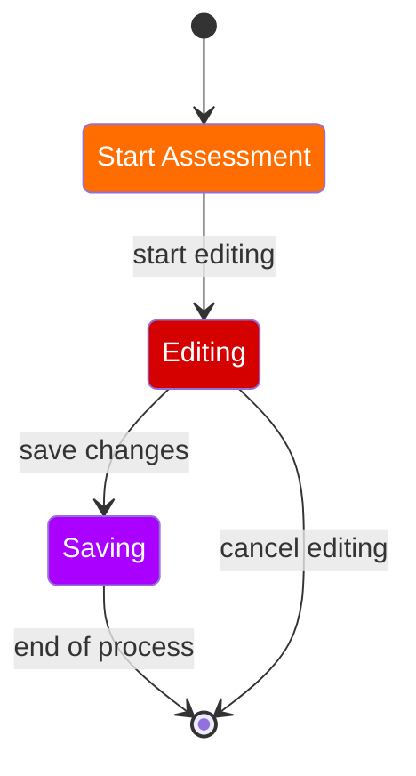

### Learner editing assessment state

```mermaid
stateDiagram
  direction TB
  [*] --> Idle
  Idle --> Editing:start editing
  Editing --> Saving:save changes
  Saving --> [*]:end of process
  Editing --> [*]:cancel editing
  Idle:Start Assessment
  style Idle fill:#FF6D00,color:#FFFFFF
  style Editing fill:#D50000,color:#FFFFFF
  style Saving fill:#AA00FF,color:#FFFFFF
```

### The editing state in this diagram maps the editing of assessment by the learner of system functional requirement 4 in Assignment 4.