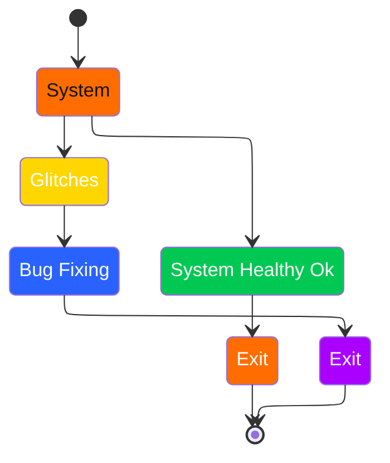

### System Update State Diagram by frontend Developers and Backend developers

```mermaid

---
config:
  layout: elk
---
stateDiagram
  direction TB
  [*] --> Still
  Still --> Moving
  Moving --> Crash
  Still --> s1
  s1 --> s2
  s2 --> [*]
  Crash --> s3
  s3 --> [*]
  Still:System
  Moving:Glitches
  Crash:Bug Fixing
  s1:System Healthy Ok
  s2:Exit
  s3:Exit
  style Still fill:#FF6D00
  style Moving fill:#FFD600,color:#FFFFFF
  style Crash fill:#2962FF,color:#FFFFFF
  style s1 fill:#00C853,color:#FFFFFF
  style s2 fill:#FF6D00,color:#FFFFFF
  style s3 fill:#AA00FF,color:#FFFFFF

```
### The state diagram mapsystem system update functional requirements.